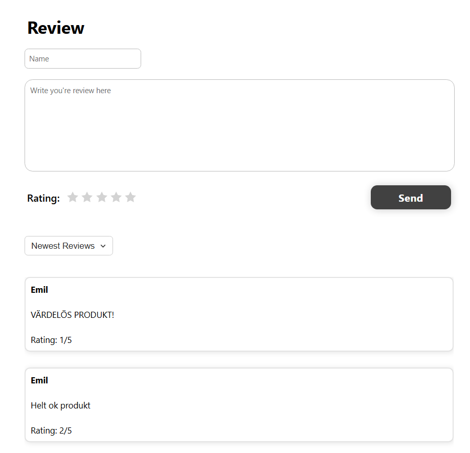

# Review Component

En återanvändbar Web Component för att skapa och visa recensioner med stjärnbetyg.

## Översikt

Review Component är en frontend-webbkomponent som tillhandahåller ett användargränssnitt för att:

- Skapa recensioner med namn, text och stjärnbetyg (1-5)
- Visa befintliga recensioner
- Sortera recensioner (nyaste, äldsta, högst betyg, lägst betyg)

## Viktigt! - Backend

Denna komponent innehåller endast frontend-koden. För att komponenten ska fungera fullt ut måste du bygga din egen backend med endpoints

### Var du fyller i dina endpoints?

I filen review-component.js finns kommentarer som visar var du ska ange dina egna routes:
 
- displayReviews() - rad 126: fetch('/review/all')
- formLogic() - rad 161: fetch('/review/create', { ... })
- commentFilter() - rad 202: fetch('/review/all')

## Installation

1. Kopiera review-component.js till ditt projekt, se till att den är exporterad/importerad till din globala .js fil om du använder en sån i din HTML.
2. Kopiera CSS-filen review-component.css till din CSS-folder, se till så att path länkarna stämmer överens.
3. Inkludera komponenten i din HTML:

## Exempel på hur komponenten ser ut utan recensioner

## Exempel på hur komponenten ser ut med recensioner

## Reflektioner

- [Tabellreflektion för namnginving](./docs/reflektioner/ReflektionerNamngivning.md)

- [Kapitelreflektion kap 2](./docs/reflektioner/Kapitelreflektion-kap2.md)

- [Tabellreflektion för funktioner/metoder](./docs/reflektioner/ReflektionerFunktioner&Metoder.md)

- [Kapitelreflektion kap 3](./docs/reflektioner/Kapitelreflektion-kap3.md)

- [Reflektion över egen kodkvalitet](./docs/reflektioner/ReflektionKodkvalitet.md)

## Testrapport

- [Testrapport](./docs/testrapport.md)