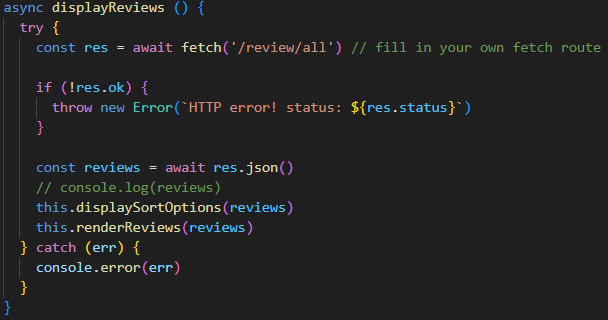
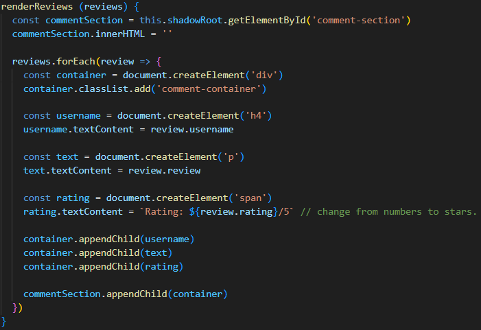
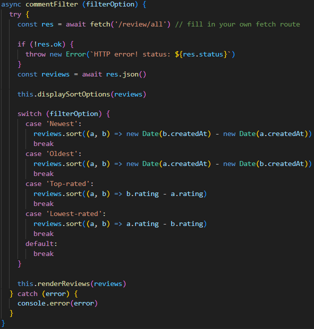
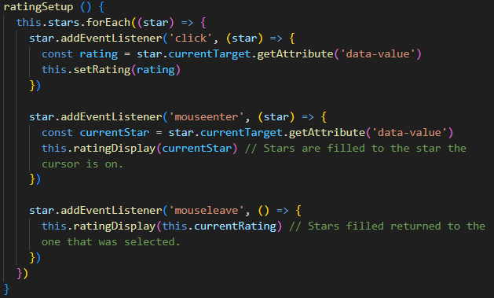
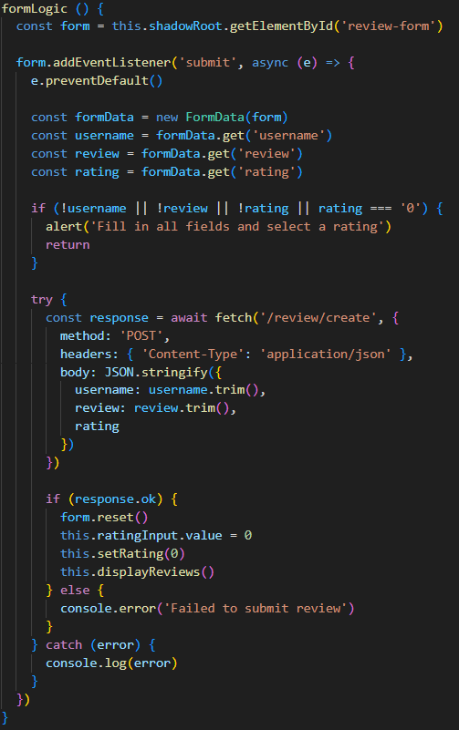

# Funktioner

| Namn                        | Kod                             | Rader | Reflektion | Förändring |
|-----------------------------|---------------------------------|-------|------------|------------|
| displayReviews()            || 15    |**Do One Thing** Just nu har displayReviews fetch och rendering av recensioner. **Use Descriptive Names** Namnet syftar bara på att recensioner visas men de hämtas också | Kan ta ur fetch och göra det till en egen metod som displayReviews använder.| Skapa en fetchReviews().
| renderReviews()             | | 23    |**Do One Thing** Rensar recensions sektionen, skapar element, och fäster elementen. **One Level of Abstracion per Function** Blandar abstraktionsnivåer genom att blanda ihop iteration av recensioner och manipuleringen av DOM | Varje element som skapas kan väl göras till egna hjälp metoder som, createUsername(), createReview(), och createRating().|
| commentFilter(filterOption) | | 32    |**Do One Thing** Hämtar, sorterar, och renderar data. **DRY** Har samma fetch kod som displayReviews(). **Switch Statements** Switch kan gömmas i en "low-level class".| Skapa en fetchReviews(), separera switch till en egen metod, och gör commentFilter() till en initierare.|
| ratingSetup()               |   | 16    |**Do(es) One Thing** Gör en sak och det är att sätta upp eventListners för rating. **Small** Bara 16 rader. **Blocks and Indenting** Pilfunktionerna har kod i sig istället för att bara vara funktion/metod anrop.| Få bort konstanterna i de 2 första eventListner så att de det bara är metoden som kallas som i sista eventListnern.|
| formLogic()                 |     | 39    |**Do One Thing** Felhantering, skickar POST request, nollställer formuläret, uppdaterar UI. **One Level of Abstraction per Function** Blandar flera olika abstraktions nivåer. **Have No Side Effects** Metodens namn är formLogic men uppdaterar UI också.| Kan delas upp i flera mindre metoder som formLogic kallar på.|

